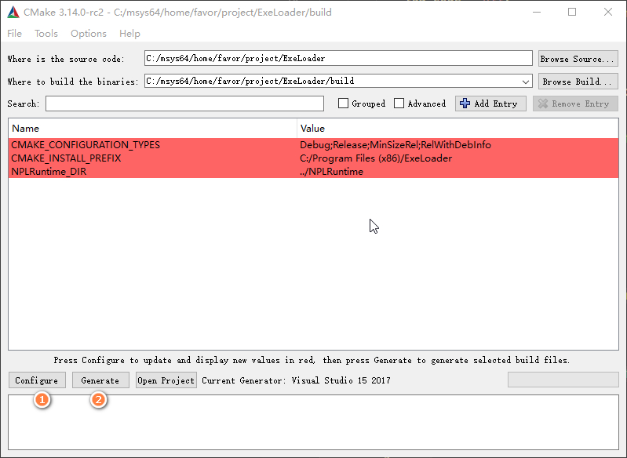

# ExeLoader

A npl dll plugin for loading and running external executable file.

## Usage

将 ExeLoader.dll 安装在 `plugins/` 目录下。

通过 activate 来调用 ExeLoader，其中的参数
- exe_path，是需要调用的外部可执行文件的路径
- input，是传输给可执行文件的标准输入内容
- callback，在可执行文件执行结束之后，会通过这个地址，通过 activate 传递执行的结果。e.g. "Mod/PyRuntime/Transpiler.lua"

```lua
NPL.activate("plugins/ExeLoader.dll", {
    exe_path = external_exe_file_path,
    input = stdin_for_exe_file,
    callback = npl_callback_file_path
})
```

在 npl_callback_file_path 中，注册 activate 方法，准备接收可执行文件的执行结果。

返回的 msg 有 3 个属性，
- runtime_error，bool 值，在底层通过 C++ 调用 exe_file 的时候有没有出现错误
- exit_code，int 值，可执行文件的退出码
- output，string 值，可执行文件的标准输出内容

```lua
local function activate()
    if msg then
        local runtime_error = msg["runtime_error"]
        local exit_code = msg["exit_code"]
        local output = msg["output"]

        if runtime_error then
            print("runtime error happened")
        else
            if exit_code != 0 then
                print("something wrong in exe running")
            else
                print("got exe stdout content:")
                print(output)
            end
        end
    end
end

NPL.this(activate)
```

## Dev

clone 代码

```
$ git clone https://github.com/tatfook/ExeLoader.git
```

通过 cmake-gui 生成 VS sln 解决方案。



VS 打开 sln 解决方案，编译，生成 dll 在 `target/` 目录下

